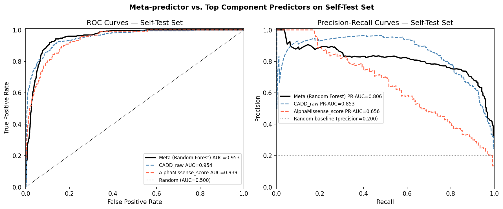
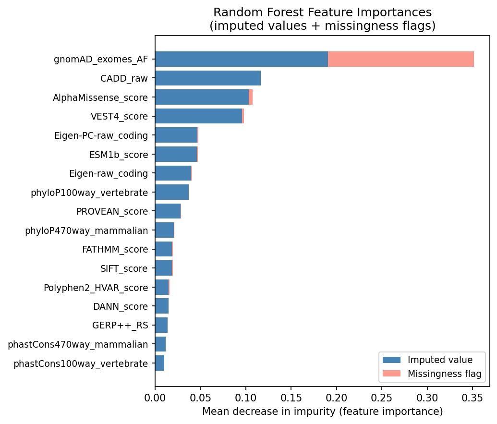
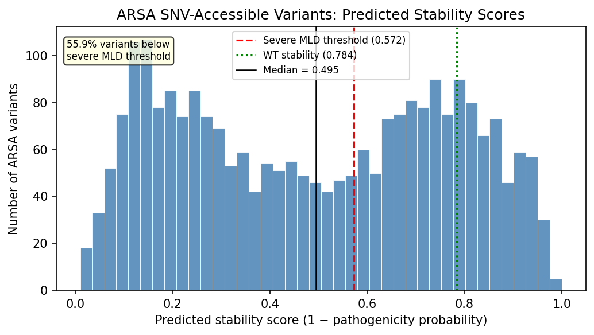
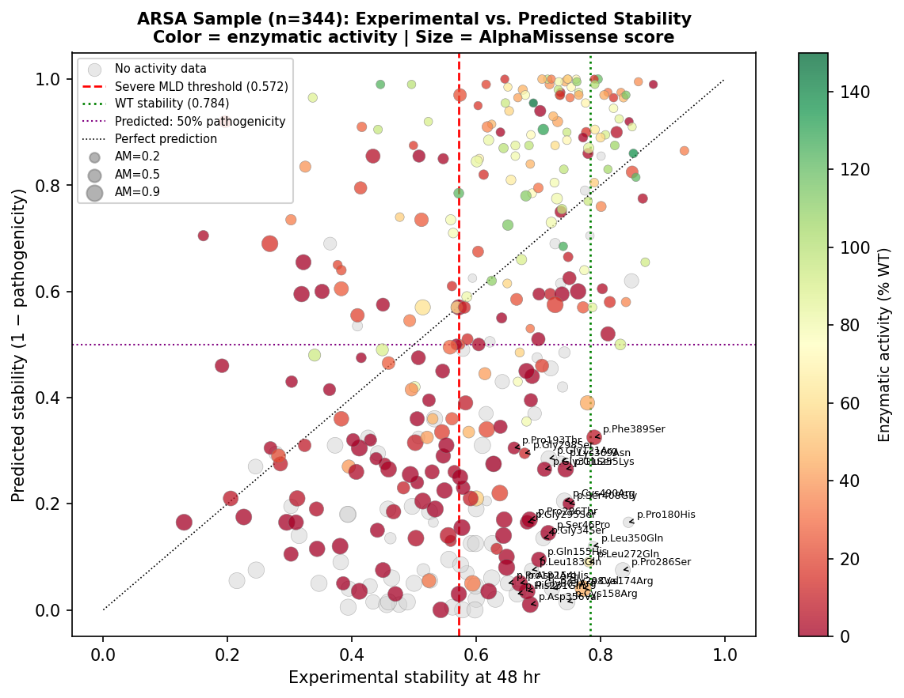

# ARSA Variant Pathogenicity Predictor

A machine learning model that predicts whether a genetic mutation in the **ARSA gene** is likely to cause **Metachromatic Leukodystrophy (MLD)** — a rare, fatal childhood disease. Predictions were submitted to the **CAGI 7 international blind challenge**, where they'll be scored against held-back lab measurements.

**Self-test AUC: 0.953** | **2,491 ARSA variants predicted** | **Berkeley C146 · Spring 2026**

---

## The Problem in One Sentence

Out of thousands of possible single-letter mutations in the ARSA gene, which ones break the protein badly enough to cause disease? We trained a Random Forest on 13,000+ clinically classified variants from other genes, then applied it to ARSA.

---

## Key Files

| | |
|--|--|
| [`notebooks/analysis.ipynb`](notebooks/analysis.ipynb) | Full pipeline — EDA, model training, evaluation, predictions |
| [`results/stability_predictions.tsv`](results/stability_predictions.tsv) | The actual CAGI 7 submission (2,491 variants) |
| [`data/`](data/README.md) | All input data with column descriptions |

---

## How It Works

1. **17 pre-computed scores** per variant (CADD, AlphaMissense, SIFT, PolyPhen-2, ESM-1b, etc.) are used as features — no raw biology needed, just the numbers.
2. A **Random Forest** learns to combine them, trained on 13,464 ClinVar variants (9:1 benign:pathogenic).
3. Preprocessing (imputation, missingness flags) runs **inside cross-validation** to prevent data leakage.
4. The model outputs `P(pathogenic)`; we submit `1 − P(pathogenic)` as a stability score (higher = more stable = more benign).

---

## Results



| Model | AUC | PR-AUC |
|---|---|---|
| **Random Forest (ours)** | **0.953** | **0.806** |
| CADD (best single predictor) | 0.954 | 0.853 |
| AlphaMissense | 0.939 | 0.656 |

The meta-predictor nearly matches the best individual tool on AUC and substantially beats it on PR-AUC — the more meaningful metric when only 9.8% of variants are pathogenic.

**Generalization:** Training CV AUC was 0.992 vs. self-test 0.953 — the gap comes from component predictors (CADD, AlphaMissense) being trained on ClinVar themselves, creating circular signal.

---

## Feature Importances



AlphaMissense and CADD dominate. Conservation scores (phastCons, phyloP) add little once variant-level predictors are present — confirmed by three independent selection methods: permutation importance, RFECV, and L1 regularization.

---

## ARSA Predictions



~55% of variants fall below the severe MLD clinical threshold (stability < 0.572). The scatter below shows predicted vs. experimental stability on the 344 labeled ARSA variants used to sanity-check orientation.



---

## Run It

```bash
git clone https://github.com/ramjhawar-alt/arsa-variant-predictor.git
cd arsa-variant-predictor
pip install -r requirements.txt
jupyter notebook notebooks/analysis.ipynb
```

Full pipeline takes ~15 minutes (grid searches). To validate the submission:

```bash
python src/validate_submission.py \
  results/stability_predictions.tsv \
  data/arsa_submission_template.tsv
```

---

## Stack

Python 3.13 · scikit-learn 1.8 · pandas 3.0 · numpy 2.4 · scipy 1.17 · matplotlib · seaborn
