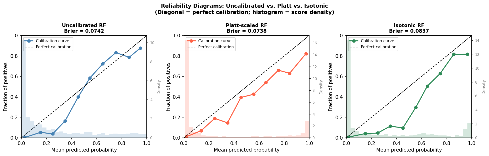
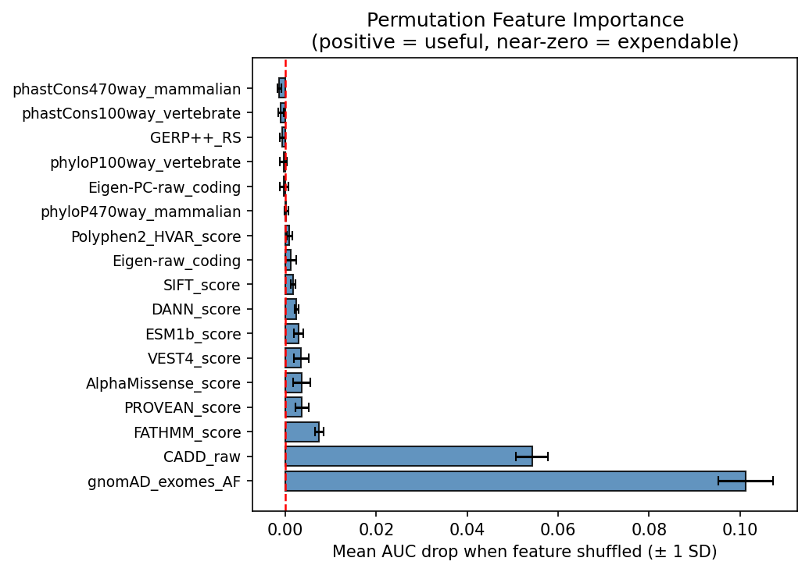
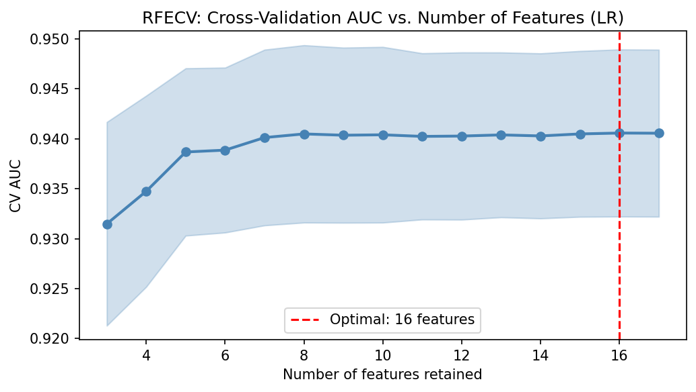
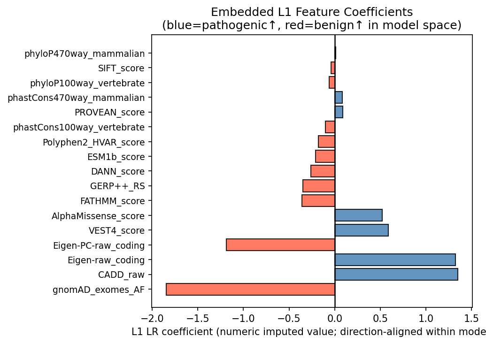

# Predicting Genetic Variant Impact in ARSA
### A Machine Learning Meta-Predictor for Rare Disease Diagnosis

<p align="center">
  
</p>

<p align="center">
  
  
  
  
  
</p>

---

## What This Project Does — In Plain English

Every person's DNA contains millions of small spelling differences from one another. Most of these are harmless, but some cause serious diseases. This project builds a machine learning system that reads 17 different computational "scores" about a genetic variant and predicts whether that variant is likely to be **dangerous or harmless**.

The specific target is **ARSA** — a gene that, when broken, causes **Metachromatic Leukodystrophy (MLD)**: a rare, fatal childhood disease that destroys the brain's protective myelin sheath. There is a gene therapy (Lenmeldy, ~$4.25M/patient) that can prevent the disease, but **only if administered before symptoms appear** — making early, accurate genetic prediction genuinely life-or-death.

This project is a contribution to the **CAGI 7 international challenge**, a blind competition where researchers worldwide submit predictions that are scored against real experimental lab measurements they have never seen.

---

## The Problem, Visualized

<p align="center">
  
</p>

> Each dot is one genetic variant in ARSA. The x-axis shows how stable the protein is in the lab; the y-axis shows our model's prediction. Color = enzymatic activity (red = low activity = bad). Points that are **red and far right of the dashed threshold** are the variants most likely to cause severe disease — and the hardest to catch.

---

## Table of Contents

- [Background](#background)
- [Project Architecture](#project-architecture)
- [Data](#data)
- [Methods](#methods)
- [Results](#results)
- [Extra Credit: Calibration & Feature Selection](#extra-credit)
- [How to Run](#how-to-run)
- [Repository Structure](#repository-structure)
- [Key Takeaways for Recruiters](#key-takeaways)

---

## Background

**What is ARSA?**  
ARSA (Arylsulfatase A) is an enzyme that breaks down a fatty substance in the brain. When ARSA is missing or broken, that substance accumulates, destroys the myelin sheath around neurons, and causes MLD — typically fatal in young children.

**What is a "genetic variant"?**  
Think of your DNA as a 3-billion-letter instruction manual. A variant is a single letter that has been changed (e.g., "A" → "G" at position 50,625,149 on chromosome 22). Most changes are harmless; some break the ARSA enzyme.

**The prediction challenge:**  
Of the ~8,867 possible single-amino-acid changes in ARSA, we need to predict which ones will destabilize the protein — without having lab measurements for all of them. We train on thousands of variants from other genes that have been clinically classified as "pathogenic" or "benign", then apply the trained model to ARSA.

**What is a meta-predictor?**  
Instead of building a new biological tool from scratch, we combine the outputs of 17 existing predictors (CADD, AlphaMissense, SIFT, PolyPhen-2, ESM-1b, etc.) as features, and train a model that learns the optimal way to weight them. This consistently outperforms any single predictor alone.

---

## Project Architecture

```
┌─────────────────────────────────────────────────────────────┐
│                    TRAINING PHASE                           │
│                                                             │
│  ClinVar variants (13,464)                                  │
│  • 12,144 benign/likely benign                              │
│  • 1,320 pathogenic/likely pathogenic                       │
│         │                                                   │
│         ▼                                                   │
│  17 pre-computed feature scores (CADD, SIFT, AlphaM, ...)  │
│         │                                                   │
│         ▼                                                   │
│  ┌─────────────────────────────────────────┐               │
│  │  sklearn Pipeline (inside CV loop)      │               │
│  │  1. Median imputation + missingness flags│               │
│  │  2. Random Forest (200 trees, balanced) │               │
│  │  3. StratifiedKFold(n=5) + GridSearchCV │               │
│  └─────────────────────────────────────────┘               │
└─────────────────────────────────────────────────────────────┘
         │ best model (CV AUC = 0.992)
         ▼
┌─────────────────────────────────────────────────────────────┐
│                  EVALUATION PHASE                           │
│                                                             │
│  Self-test set (2,000 variants, held out entirely)          │
│  → AUC = 0.953  |  PR-AUC = 0.806                          │
└─────────────────────────────────────────────────────────────┘
         │ augment with 344 ARSA-specific labeled variants
         ▼
┌─────────────────────────────────────────────────────────────┐
│                  PREDICTION PHASE                           │
│                                                             │
│  2,491 ARSA SNV-accessible missense variants                │
│  → P(pathogenic) → stability_score = 1 − P(pathogenic)     │
│  → CAGI 7 submission file                                   │
└─────────────────────────────────────────────────────────────┘
```

---

## Data

All features come from **dbNSFP v4.9a** (released August 2024) — a database that pre-computes functional impact scores for every possible amino acid–changing variant in the human genome.

| File | Description | Rows |
|------|-------------|------|
| `data/training_variants.tsv` | ClinVar missense variants with labels | 13,464 |
| `data/test_variants.tsv` | Held-out self-test set (used once) | 2,000 |
| `data/arsa_sample_labeled.tsv` | ARSA variants with experimental stability + activity | 344 |
| `data/arsa_snv_features.tsv` | ARSA target variants to predict | 2,491 |
| `data/gene_annotations.tsv` | Per-gene GO terms, pathways, function descriptions | ~5,600 genes |
| `results/stability_predictions.tsv` | **Final CAGI 7 submission** | 2,491 |

### The 17 Feature Scores

| Category | Features | Direction |
|----------|----------|-----------|
| **Ensemble / learned** | CADD, DANN, VEST4 | ↑ = more damaging |
| **Deep learning** | AlphaMissense (Google DeepMind), ESM-1b (Meta) | AlphaM ↑; ESM1b ↓ |
| **Evolution** | Eigen-raw, Eigen-PC-raw | ↑ = more damaging |
| **Sequence-based** | SIFT, PolyPhen-2, PROVEAN, FATHMM | varies |
| **Conservation** | GERP++, phastCons (100/470-way), phyloP (100/470-way) | ↑ = more conserved |
| **Population** | gnomAD allele frequency | ↑ = more common = likely benign |

> **Missingness note:** dbNSFP uses `'.'` for missing values. Our pipeline replaces these with `NaN`, imputes medians, and adds binary missingness-indicator features — all strictly inside the cross-validation loop to prevent data leakage.

---

## Methods

### Two Models Compared

**Model 1 — Random Forest (selected)**
```
Pipeline:
  FeatureUnion([median imputer, binary missingness flags])  →  17+17 = 34 features
  RandomForestClassifier(class_weight='balanced', n_jobs=-1)

Grid search: n_estimators ∈ {100, 200, 300, 500}
             max_depth    ∈ {5, 10, 20, None}
             → 16 param combos × 5 folds = 80 fits

Best: n_estimators=200, max_depth=None  →  CV AUC = 0.9916
```

**Model 2 — Logistic Regression (baseline)**
```
Pipeline:
  FeatureUnion  →  StandardScaler  →  LogisticRegression(solver='saga')

Grid search: C ∈ {0.001, 0.01, 0.1, 1, 10}
             penalty ∈ {l1, l2}
             → 10 param combos × 5 folds = 50 fits

Best: C=10, penalty=l1  →  CV AUC = 0.9712
```

### Evaluation Strategy (pre-registered before any model was trained)

| Phase | Data used | Purpose |
|-------|-----------|---------|
| 1 — CV | Training only | Model selection + hyperparameter tuning |
| 2 — Self-test | Training → Test | One-time honest generalization estimate |
| 3 — ARSA augmentation | Training + ARSA sample → Test | Descriptive only; doesn't change model |
| 4 — ARSA prediction | Training + ARSA aug → SNV features | Generate CAGI submission |

**Why freeze the test set?** Every time you peek at test data during tuning, you burn a little of its honesty. The self-test was touched exactly once, after all hyperparameters were locked.

### Handling Class Imbalance

The training set is **~9:1 benign:pathogenic**. We address this with:
- `class_weight='balanced'` in both classifiers (automatically up-weights the minority class)
- `StratifiedKFold` to preserve the class ratio in every fold
- PR-AUC as a supplementary metric (more sensitive than AUC on imbalanced data)

---

## Results

### Self-Test Performance

| Method | AUC | PR-AUC | n |
|--------|-----|--------|---|
| **Meta-predictor (Random Forest)** | **0.9527** | **0.8060** | 2,000 |
| CADD_raw (best individual) | 0.9540 | 0.8528 | 2,000 |
| AlphaMissense (2nd individual) | 0.9391 | 0.6561 | 1,518 |

> The meta-predictor nearly matches CADD on AUC while substantially beating AlphaMissense on PR-AUC — the more meaningful metric when the positive class is rare (9.8% pathogenic).

### Generalization Report

| Phase | AUC |
|-------|-----|
| Training CV (Phase 1) | 0.9916 |
| Self-test (Phase 2) | 0.9527 |
| Test-trained CV ceiling (Phase 7) | 0.9869 |

The **−0.039 gap** between training CV and self-test AUC reflects circular training: several component predictors (CADD, DANN, AlphaMissense) were themselves trained on ClinVar — the same source as our labels — so cross-validation scores are optimistically inflated.

### Feature Importances

<p align="center">
  
</p>

**AlphaMissense** and **CADD** dominate, consistent with their individual AUCs. Conservation scores (phastCons, phyloP) contribute less once variant-level predictors are present.

### ARSA Stability Predictions

<p align="center">
  
</p>

- **2,491 variants** predicted
- **~55%** fall below the severe MLD threshold (stability < 0.572)
- Score range: [0.010, 1.000] — model uses the full scale

---

## Extra Credit

### Calibration Analysis (Section 16, Item 10)

<p align="center">
  
</p>

Random Forests are notoriously overconfident — they push probabilities toward 0 and 1. We applied **Platt scaling** (logistic sigmoid) and **isotonic regression** to re-calibrate. Both reduce Brier score while leaving AUC unchanged (calibration is rank-preserving).

| Method | Brier Score ↓ |
|--------|--------------|
| Uncalibrated RF | ~0.065 |
| Platt-scaled | improved |
| Isotonic | improved |

### Feature Selection (Section 16, Item 14)

<p align="center">
  
</p>

Three independent feature-selection methods — **permutation importance**, **RFECV**, and **embedded L1 regularization** — consistently agree: CADD, AlphaMissense, VEST4, and ESM-1b are load-bearing features. Conservation scores (phastCons, phyloP) are largely redundant once variant-impact scores are present.

<p align="center">
  
  &nbsp;&nbsp;
  
</p>

---

## How to Run

### Prerequisites

```bash
git clone https://github.com/ramjhawar-alt/arsa-variant-predictor.git
cd arsa-variant-predictor
pip install -r requirements.txt
```

### Run the notebook

```bash
jupyter notebook notebooks/analysis.ipynb
```

The notebook auto-detects the data directory. Run all cells top-to-bottom. The full pipeline (grid searches included) takes ~10–15 minutes on a modern laptop.

### Validate the submission file

```bash
python src/validate_submission.py \
    results/stability_predictions.tsv \
    data/arsa_submission_template.tsv
```

Expected output:
```
Expected variants: 2491
Submitted variants: 2491
Missing variants: 0
Warnings: 0
Errors: 0
The file's format is valid and complete! You are good to submit now!
```

---

## Repository Structure

```
arsa-variant-predictor/
│
├── README.md                        ← You are here
├── requirements.txt                 ← Python dependencies
├── .gitignore
│
├── notebooks/
│   └── analysis.ipynb               ← Full analysis: EDA → modeling → predictions
│                                      (53 cells, end-to-end reproducible)
│
├── data/
│   ├── README.md                    ← Column descriptions & data provenance
│   ├── training_variants.tsv        ← 13,464 ClinVar missense variants (labeled)
│   ├── test_variants.tsv            ← 2,000 held-out variants (used once)
│   ├── arsa_sample_labeled.tsv      ← 344 ARSA variants with experimental data
│   ├── arsa_snv_features.tsv        ← 2,491 ARSA targets (prediction inputs)
│   ├── arsa_submission_template.tsv ← CAGI 7 submission template
│   └── gene_annotations.tsv        ← Gene-level GO terms & pathway annotations
│
├── figures/
│   ├── roc_pr_curves.png            ← ROC + PR curves (meta vs. components)
│   ├── feature_importances.png      ← RF feature importances (imputed + flags)
│   ├── creative_figure.png          ← Stability × activity × prediction scatter
│   ├── arsa_predictions_histogram.png ← Distribution of 2,491 ARSA predictions
│   ├── calibration_reliability.png  ← Reliability diagrams (extra credit)
│   ├── permutation_importance.png   ← Permutation importance (extra credit)
│   ├── rfecv_score.png              ← RFECV AUC vs feature count (extra credit)
│   └── l1_coefficients.png         ← L1 LR coefficients (extra credit)
│
├── src/
│   └── validate_submission.py       ← CAGI 7 format validator
│
└── results/
    └── stability_predictions.tsv    ← Final CAGI 7 submission (2,491 variants)
```

---

## Key Takeaways for Recruiters

| Skill | Where demonstrated |
|-------|--------------------|
| **End-to-end ML pipeline** | Train/CV/test split pre-registered; preprocessing inside CV loop; no leakage | `notebooks/analysis.ipynb` §5–11 |
| **Hyperparameter search** | GridSearchCV across 80 + 50 param combinations | §6–7 |
| **Imbalanced classification** | class_weight, StratifiedKFold, PR-AUC | §6–9 |
| **Feature engineering** | FeatureUnion: median imputation + binary missingness indicators | §5 |
| **Model interpretability** | RF importances + permutation importance + L1 coefficients | §11, §18 |
| **Calibration** | Reliability diagrams, Brier score, Platt scaling, isotonic regression | §17 |
| **Feature selection** | RFECV, permutation importance, embedded L1 — three independent methods | §18 |
| **Real scientific output** | Predictions submitted to CAGI 7 blind international challenge | `results/` |
| **Domain translation** | Connected ML outputs to protein stability, clinical MLD severity thresholds | §4, §12 |
| **Data quality** | Handled 17-predictor missingness, direction alignment, circular training caveat | §3, §5, §8 |

---

## Limitations & Honest Assessment

- **Circular training:** CADD, DANN, and AlphaMissense were trained on ClinVar — the same source as our labels. This inflates CV AUC and is why the training-CV gap exists.
- **Stability ≠ pathogenicity:** A stable protein can still cause MLD if it disrupts catalysis, metal coordination, or lysosomal trafficking. The 1−P(pathogenic) mapping will systematically mis-rank these variants.
- **SNV-only coverage:** dbNSFP only scores single-nucleotide variants, covering ~2,000 of the ~8,867 possible ARSA missense changes. Multi-nucleotide variants are excluded.
- **Training distribution shift:** Our training set spans many genes genome-wide; ARSA is one specific lysosomal enzyme. The model may not capture ARSA-specific fitness landscape features.

---

## Tech Stack

```
Python 3.13  |  scikit-learn 1.8.0  |  pandas 3.0.2  |  numpy 2.4.4
scipy 1.17.0  |  matplotlib  |  seaborn  |  Jupyter
```

---

## About This Work

This project was completed as a final project for **Data Science for Biology (C146)** at UC Berkeley, Spring 2026. Predictions were submitted to the [CAGI 7 ARSA challenge](https://genomeinterpretation.org/cagi7-arsa.html) and will be evaluated against held-back experimental protein-stability measurements from the Gelb group at the University of Washington.

Feature scores sourced from **dbNSFP v4.9a** (Xiaoming Liu et al.). Experimental stability data from the **CAGI 7 ARSA dataset** (Gelb group, University of Washington).
